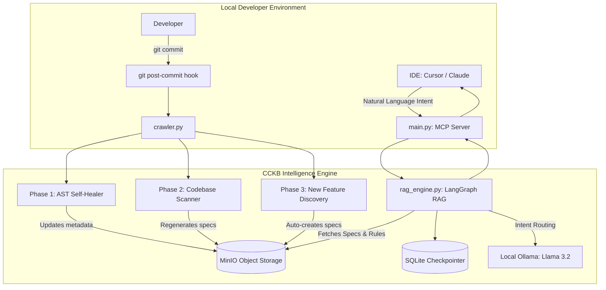

# 🧠 CCKB: Codebase Context & Knowledge Base

[](https://opensource.org/licenses/MIT)
[](https://www.python.org/downloads/release/python-3110/)
[](https://modelcontextprotocol.io)

**CCKB** (Codebase Context & Knowledge Base) is a developer intelligence layer that automatically maps, maintains, and serves a queryable architectural knowledge base of any codebase. It operates as a local Model Context Protocol (MCP) server, integrating with modern AI-enabled IDEs (like Cursor, VS Code, or Claude Desktop) to provide LLMs with complete, self-healing, and up-to-date specifications of codebase architectures, files, dependencies, and style guidelines.

---

## 🔍 How It Works



1. **Onboarding / Code-First Fallback**: During initialization, CCKB scans the target repository's git history. Using **LangGraph** and a local **Ollama** model, it synthesizes a global **Project Constitution (`hot_memory.md`)** containing codebase conventions, styling patterns, and system guidelines.
2. **Codebase Scanning**: It analyzes the repository's file structure to identify key entry points (e.g., API routes, controllers, services) and automatically generates structured **Feature Specifications** (Markdown spec + JSON metadata with precise file dependency mapping) using LLM domain discovery.
3. **Continuous Self-Healing (Git Hook)**: A background git post-commit hook monitors code changes:
   - **AST Rename Matcher**: Detects function/method renames across commits and automatically updates the dependency references in your MinIO metadata so the context remains valid.
   - **Spec Regeneration**: Identifies which feature specs are affected by modified files and regenerates them in the background (with rate limiting).
   - **New Feature Auto-Discovery**: Detects new entry points introduced in commits and auto-indexes them.
4. **LangGraph RAG & MCP Server**: When you query the server via the `/cckb_query` tool in your IDE, a LangGraph RAG pipeline routes your intent, pulls the relevant specs, metadata, and Project Constitution from MinIO, and synthesizes a context-rich prompt payload for the LLM.

---

## 🛠️ Prerequisites

Ensure your local machine has the following tools installed and running:

* **Python 3.11** (recommended version, compatible with FastMCP SDK)
* **Docker & Docker Compose** (for running the database and LLM containers)
* **Git** (required for repository analysis and hooks)
* **Ollama** (for local inference, runs inside Docker)

---

## 🚀 Quick Start

Follow these steps to set up and run CCKB locally:

### 1. Spin up the Local Infrastructure
CCKB uses Docker Compose to launch a local **MinIO** storage engine (for caching specs and metadata) and a local **Ollama** daemon.

```bash
# Start MinIO (port 9000) and Ollama (port 11434)
docker compose up -d
```
> [!NOTE]
> The ephemeral `model-loader` container will automatically pull the required `llama3.2:3b` model to Ollama once it boots.

### 2. Configure the Python Virtual Environment
Initialize a virtual environment and install the required dependencies:

```bash
# Initialize venv
python3.11 -m venv .venv
source .venv/bin/activate

# Install required dependencies
pip install -r requirements.txt
```

### 3. Run the Test Suite (Optional)
Verify that everything is set up correctly by running the integration and E2E test suite:

```bash
pytest -v
```

---

## 📥 Onboarding a Repository

You can onboard **any repository** (supporting Next.js, FastAPI, Flask, Go, Java, Rust, Ruby, TypeScript, etc.) into the CCKB knowledge base.

### Option A: Initialize via FastAPI Web UI (Recommended)
CCKB includes a beautiful web interface to configure credentials and onboard a repository using a code-first approach.

```bash
# Run the init UI server from the root of the target repository
# (Ensure your venv is activated and dependencies are installed)
/Users/shayne/Documents/local-cckb/.venv/bin/python3 /Users/shayne/Documents/local-cckb/main.py --init
```
1. This command opens a dashboard at `http://127.0.0.1:3000` (or the next available port).
2. Choose **Skip and Generate from Code** to execute a code-first onboarding.
3. The server will:
   * Generate the **Project Constitution** (`hot_memory.md`) from git log history using LangGraph.
   * Auto-discover feature domains, generate specs, and upload them to MinIO.
   * Silently install the post-commit git hook in your repo.
   * Shut down automatically once completion is achieved.

### Option B: Onboard via Command Line
You can also trigger a codebase scan directly using the CLI:

```bash
# Scan a repository and generate feature specs
.venv/bin/python3 codebase_scanner.py --repo /path/to/target-repo
```

**Key CLI Options:**
* `--repo`: Absolute path to the repository root (defaults to current directory).
* `--dry-run`: Scans code and discovers domains without uploading anything to MinIO.
* `--no-llm`: Skips Ollama processing and uses pre-defined static templates for faster onboarding.

---

## 🔌 IDE Integration (MCP Client Setup)

To use CCKB with your AI coding assistants, add it as an MCP server.

### 1. Claude Desktop
Add the following block to your Claude Desktop configuration file (typically located at `~/Library/Application Support/Claude/claude_desktop_config.json`):

```json
{
  "mcpServers": {
    "cckb": {
      "command": "/Users/shayne/Documents/local-cckb/.venv/bin/python3",
      "args": ["/Users/shayne/Documents/local-cckb/main.py"]
    }
  }
}
```

### 2. Cursor
1. Open Cursor and navigate to **Settings** > **Features** > **MCP**.
2. Click **+ Add New MCP Server**.
3. Fill in the fields:
   * **Name**: `cckb`
   * **Type**: `stdio`
   * **Command**: `/Users/shayne/Documents/local-cckb/.venv/bin/python3 /Users/shayne/Documents/local-cckb/main.py`
4. Click **Save**.

### 💬 Example Queries
Once connected, you can ask your AI assistant questions like:
* *"Run a CCKB query to understand how SSO authentication is structured in this repo"*
* *"Ask cckb_query about what styles and color guidelines we follow"*
* *"Use the cckb tool to find the dependencies of the AUTHENTICATION feature"*

---

## 🔄 Post-Commit Crawler & AST Self-Healer

When you onboard a repository, a post-commit git hook is installed at `.git/hooks/post-commit` which runs the crawler in a detached background process.

### Manual Git Hook Installation
If you need to install the hook manually in a repository:

```bash
# cd to the target repository
cd /path/to/target-repo

# Run the installer pointing to the central cckb installation
/Users/shayne/Documents/local-cckb/.venv/bin/python3 /Users/shayne/Documents/local-cckb/crawler.py --install
```

### How the Hook Crawler Heals Data
When you commit a Python file with a renamed function (e.g. renaming `verify_user_id` to `validate_user_session`):
1. The hook triggers `crawler.py --post-commit` in the background.
2. It parses the old source code and the new source code using Python's **Abstract Syntax Tree (AST)** module.
3. It identifies that the function body remains structurally similar but the name changed.
4. It connects to MinIO, finds all cached feature spec JSON metadata files listing `verify_user_id` as a dependency, and updates them to reference `validate_user_session` automatically.
5. It then regenerates the prose in the corresponding `.md` spec files using Ollama.

---

## ⚙️ Configuration & Customization

### Credentials & Environment Variables
Each target repository stores its local configuration and secrets in `.cckb/.env`. This directory is automatically added to the target repo's `.gitignore` during initialization.

```env
# Credentials for the MinIO client
MINIO_ROOT_USER=minioadmin
MINIO_ROOT_PASSWORD=minioadmin123

# (Optional) External API credentials for richer context generation
JIRA_API_KEY=your_jira_api_key
NOTION_API_KEY=your_notion_api_key
```

### Model Performance and Optimization
* By default, CCKB uses **Llama 3.2 (3B)** locally via Ollama. 
* Spec generation and routing are designed to run fully offline. A domain discovery pass on a medium-sized repository (~150 files) takes about **60 seconds** on a modern Apple Silicon machine.
* To speed up discovery times to less than **3 seconds**, you can optionally configure an external LLM provider by editing the environment.

---

## 📂 Project Structure

```
local-cckb/
├── .cckb/                  # Local sqlite checkpoints and logs
├── codebase_scanner.py     # Framework analysis & spec generator
├── init_engine.py          # FastAPI UI & LangGraph fallback constitution engine
├── main.py                 # FastMCP server entry point
├── rag_engine.py           # LangGraph RAG query handler & SQLite saver
├── crawler.py              # AST self-healer & Git post-commit hook
├── docker-compose.yml      # Local MinIO & Ollama services
├── requirements.txt        # Python dependency manifest
└── tests/                  # Complete test suite (60 unit/integration tests)
```

---

## 📄 License

This project is licensed under the MIT License - see the LICENSE file for details.
